# طراحی مانیتورینگ حجم بسته و بهینه‌سازی عملکرد

## نمای کلی

این طراحی شامل پیاده‌سازی سیستم جامع مانیتورینگ حجم بسته، بهینه‌سازی‌های پیشرفته موبایل، بهبود دسترسی‌پذیری، و یکپارچگی React Query برای اپلیکیشن مدیریت مخاطبین نما-۱ است. این راه‌حل بر بهبود تجربه کاربری از طریق مانیتورینگ عملکرد، تقویت تعاملات لمسی، و مدیریت محکم state متمرکز است.

**بهبودهای هدف:**
- مانیتورینگ و بهینه‌سازی حجم بسته
- تقویت تعاملات لمسی و پاسخگویی موبایل
- ویژگی‌های جامع دسترسی‌پذیری با برچسب‌های ARIA و ناوبری کیبورد
- یکپارچگی React Query برای مدیریت کارآمد state سرور

## پشته تکنولوژی و وابستگی‌ها

### تحلیل پشته فعلی
- **فریمورک فرانت‌اند:** React 18.3.1 با TypeScript 5.5.3
- **ابزار ساخت:** Vite 6.3.4 با تنظیمات حداقلی
- **مدیریت State:** React state پایه + @tanstack/react-query 5.56.2 (کاملاً یکپارچه نشده)
- **فریمورک موبایل:** Capacitor 7.4.2
- **کتابخانه UI:** Radix UI با Tailwind CSS 3.4.11

### وابستگی‌های مورد نیاز
```mermaid
graph TD
    A[Bundle Analysis] --> B[rollup-plugin-visualizer]
    A --> C[vite-bundle-analyzer]
    
    D[Mobile Optimization] --> E[react-spring]
    D --> F[@use-gesture/react]
    
    G[Accessibility] --> H[focus-trap-react]
    G --> I[aria-live-region]
    
    J[Performance] --> K[web-vitals]
    J --> L[react-error-boundary]
    
    style B fill:#e8f5e8,stroke:#2e7d32
    style C fill:#e8f5e8,stroke:#2e7d32
    style E fill:#fff3e0,stroke:#f57c00
    style F fill:#fff3e0,stroke:#f57c00
    style H fill:#e3f2fd,stroke:#1976d2
    style I fill:#e3f2fd,stroke:#1976d2
    style K fill:#fce4ec,stroke:#c2185b
    style L fill:#fce4ec,stroke:#c2185b
```

## معماری

### معماری تحلیل بسته

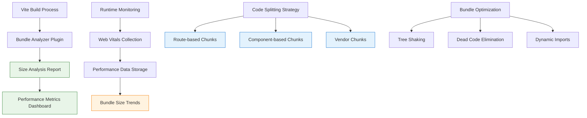

### معماری تعامل لمسی موبایل

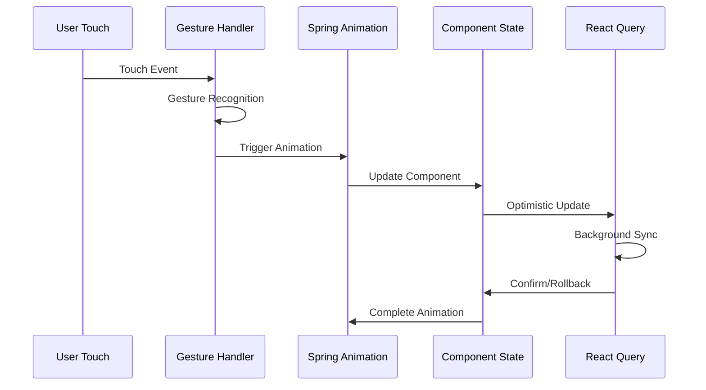

### معماری یکپارچگی React Query

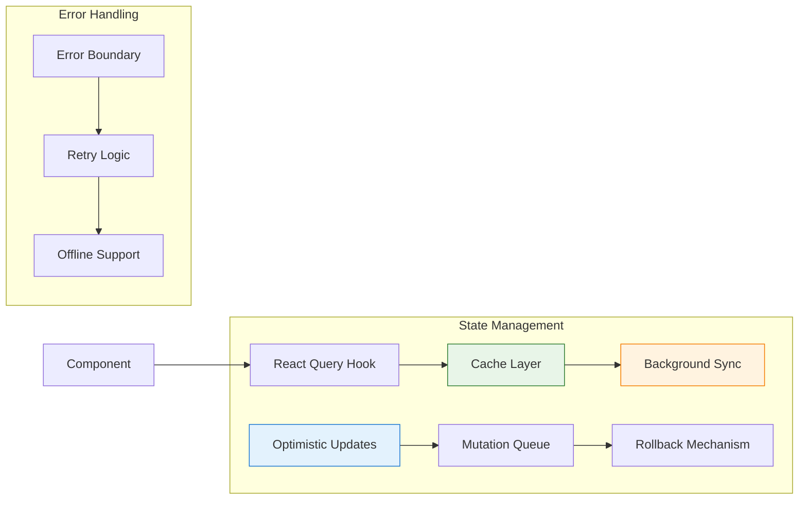

## معماری کامپوننت

### کامپوننت مانیتور حجم بسته

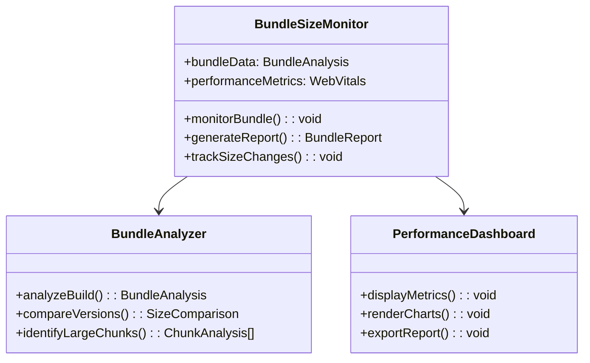

### کامپوننت‌های بهبود یافته موبایل

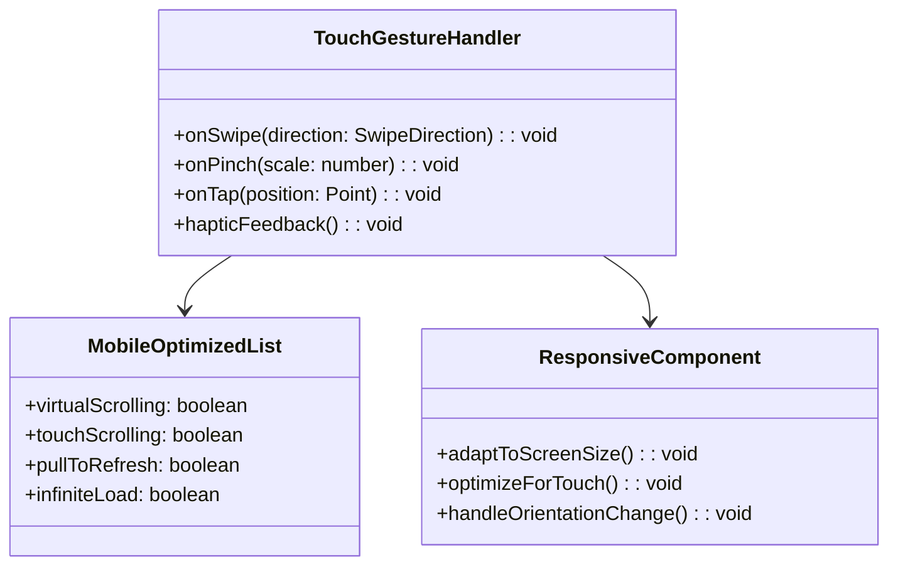

### کامپوننت‌های تقویت دسترسی‌پذیری

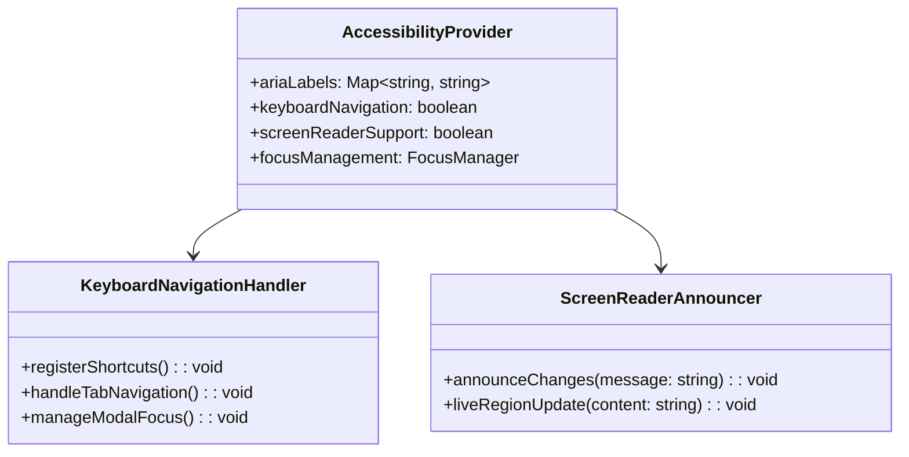

## مدل‌های داده و مدیریت State

### مدل‌های تحلیل بسته

| مدل | ویژگی‌ها | توضیحات |
|-------|------------|-------------|
| `BundleAnalysis` | `totalSize`, `chunkSizes`, `dependencies`, `timestamp` | داده‌های کامل تحلیل بسته |
| `ChunkInfo` | `name`, `size`, `modules`, `optimized` | اطلاعات تک تک chunk ها |
| `PerformanceMetric` | `metric`, `value`, `threshold`, `trend` | Web Vitals و معیارهای سفارشی |
| `SizeComparison` | `current`, `previous`, `diff`, `percentage` | داده‌های مقایسه نسخه‌ها |

### ساختار State در React Query

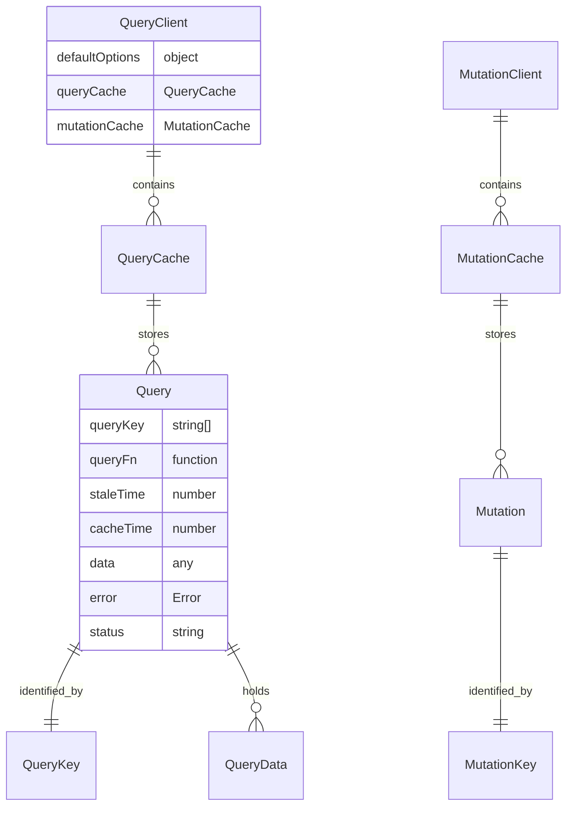

### مدل‌های State لمس موبایل

| مدل | ویژگی‌ها | توضیحات |
|-------|------------|-------------|
| `TouchState` | `isPressed`, `position`, `velocity`, `gesture` | وضعیت فعلی تعامل لمسی |
| `GestureConfig` | `swipeThreshold`, `pinchScale`, `tapTimeout` | تنظیمات حرکات لمسی |
| `AnimationState` | `progress`, `duration`, `easing`, `interpolation` | وضعیت انیمیشن فنری |

## لایه یکپارچگی API

### سرویس تحلیل بسته

```typescript
interface BundleAnalysisService {
  // مانیتورینگ حجم بسته
  analyzeBuild(): Promise<BundleAnalysis>
  trackSizeChanges(buildId: string): Promise<SizeHistory>
  generateReport(timeRange: DateRange): Promise<BundleReport>
  
  // مانیتورینگ عملکرد
  collectWebVitals(): Promise<WebVitalsData>
  trackLoadTimes(): Promise<LoadTimeMetrics>
  monitorMemoryUsage(): Promise<MemoryStats>
}
```

### تنظیمات React Query

```typescript
interface QueryConfiguration {
  // گزینه‌های پیش‌فرض کوئری
  staleTime: 5 * 60 * 1000 // ۵ دقیقه
  cacheTime: 10 * 60 * 1000 // ۱۰ دقیقه
  retry: 3
  retryDelay: (attemptIndex: number) => Math.min(1000 * 2 ** attemptIndex, 30000)
  
  // گزینه‌های تغییر
  onError: (error: Error) => void
  onSuccess: (data: any) => void
  onSettled: () => void
}
```

### API های بهینه‌سازی موبایل

```typescript
interface MobileOptimizationAPI {
  // تعامل لمسی
  registerGestureHandlers(element: HTMLElement): GestureHandlers
  enableHapticFeedback(): Promise<void>
  optimizeScrolling(container: HTMLElement): ScrollOptimizer
  
  // بهینه‌سازی عملکرد
  enableVirtualScrolling(listRef: RefObject<HTMLElement>): VirtualScrollConfig
  preloadCriticalResources(): Promise<void>
  adaptToConnectionSpeed(): ConnectionAdapter
}
```

## مسیریابی و ناوبری

### ناوبری بهبود یافته با دسترسی‌پذیری

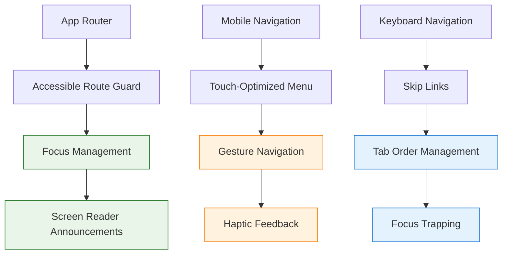

### تقسیم کد بر اساس مسیر (Route) - بهبود یافته

| مسیر | استراتژی Chunk | اولویت Preload | هدف حجم بسته |
|-------|----------------|------------------|-------------------|
| `/login` | مستقل | بالا | < ۵۰ کیلوبایت |
| `/contacts` | بر اساس ویژگی | متوسط | < ۱۰۰ کیلوبایت |
| `/statistics` | تنبل + Prefetch | پایین | < ۷۵ کیلوبایت |
| `/settings` | درخواست محور | پایین | < ۴۰ کیلوبایت |

## استراتژی بهینه‌سازی عملکرد

### تکنیک‌های بهینه‌سازی حجم بسته

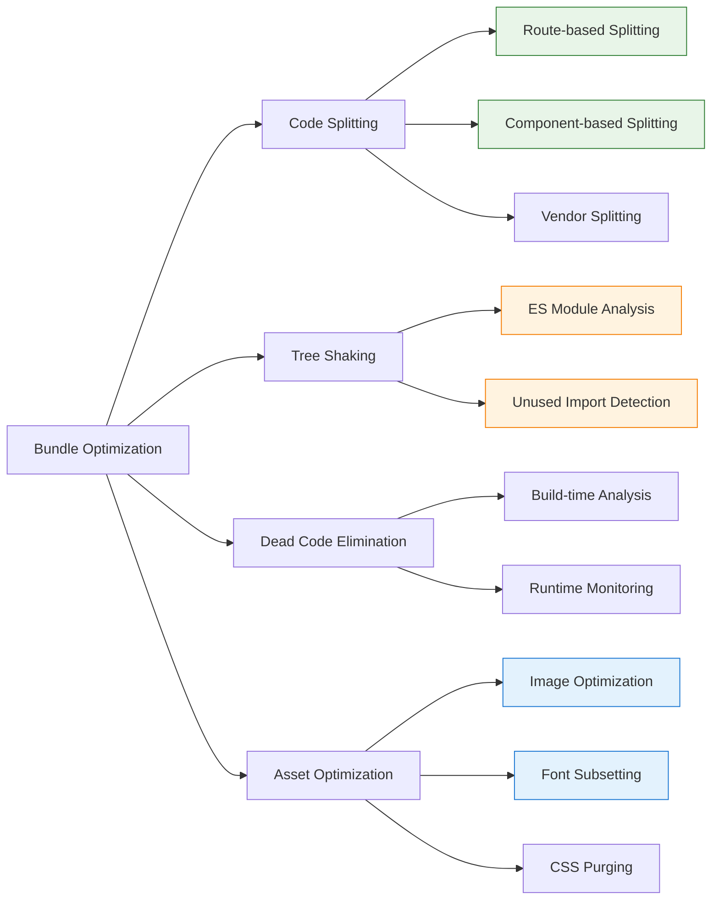

### Performance Monitoring Dashboard

| Metric | Target | Current | Monitoring Tool |
|--------|--------|---------|-----------------|
| Bundle Size | < 500KB | TBD | Rollup Visualizer |
| First Contentful Paint | < 1.5s | TBD | Web Vitals |
| Largest Contentful Paint | < 2.5s | TBD | Web Vitals |
| Cumulative Layout Shift | < 0.1 | TBD | Web Vitals |
| First Input Delay | < 100ms | TBD | Web Vitals |
| Time to Interactive | < 3s | TBD | Lighthouse |

### بهینه‌سازی‌های عملکرد موبایل

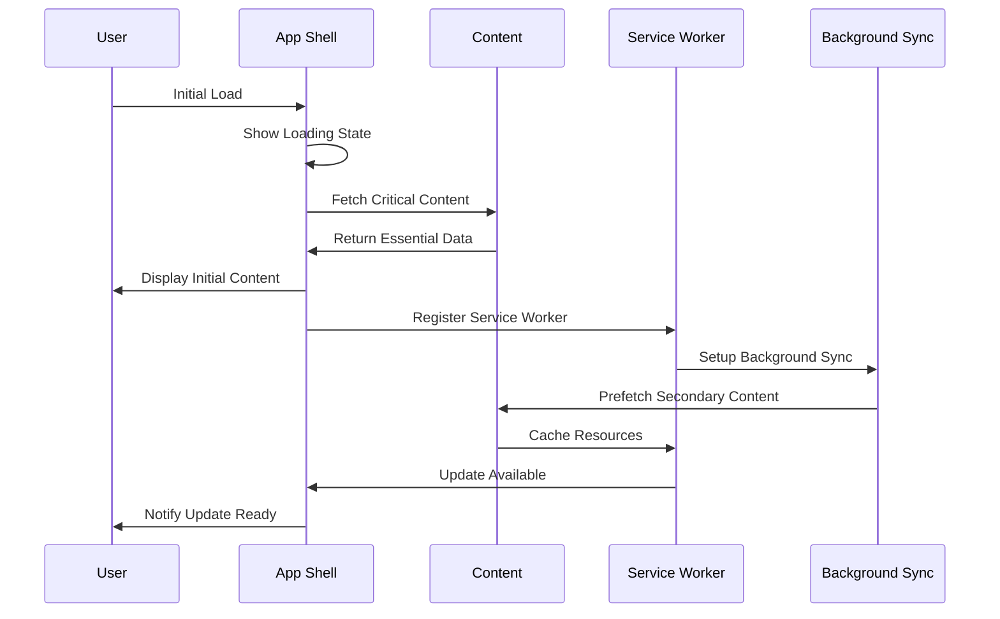

## مدیریت State با React Query

### طراحی ساختار کوئری

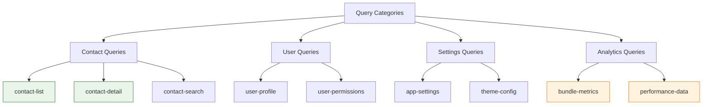

### استراتژی کش

| نوع داده | زمان کهنه شدن | زمان کش | به‌روزرسانی پس‌زمینه |
|-----------|------------|------------|-------------------|
| لیست مخاطبین | ۲ دقیقه | ۱۰ دقیقه | با فوکوس پنجره |
| پروفایل کاربر | ۵ دقیقه | ۳۰ دقیقه | در زمان مانت |
| تنظیمات اپ | ۱۰ دقیقه | ۱ ساعت | دستی |
| معیارهای بسته | ۱ ساعت | ۲۴ ساعت | برنامه‌ریزی شده |
| داده‌های عملکرد | ۳۰ دقیقه | ۲ ساعت | با فاصله زمانی |

## پیاده‌سازی دسترسی‌پذیری

### استراتژی برچسب‌های ARIA و نقش‌ها

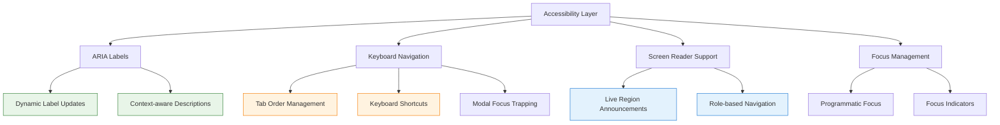

### الگوهای ناوبری کیبورد

| کامپوننت | میانبر کیبورد | عمل | صفحه‌خوان |
|-----------|------------------|--------|---------------|
| لیست مخاطبین | `کلیدهای پیکان` | حرکت بین آیتم‌ها | اعلام انتخاب |
| فیلد جستجو | `Ctrl+F` | فوکوس جستجو | "جستجوی مخاطبین" |
| پنجره مدال | `Escape` | بستن پنجره | "پنجره بسته شد" |
| فیلدهای فرم | `Tab` | حرکت بین فیلدها | برچسب‌های فیلد |
| دکمه‌های عمل | `Enter/Space` | فعالسازی | هدف دکمه |

## استراتژی تست

### تست حجم بسته

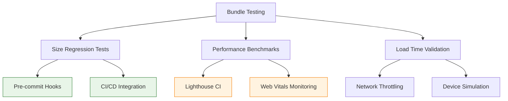

### Mobile Touch Testing

| Test Category | Test Cases | Tools | Expected Result |
|---------------|------------|-------|-----------------|
| Gesture Recognition | Swipe, pinch, tap | Cypress touch events | Accurate gesture detection |
| Touch Targets | Button size, spacing | Accessibility testing | Min 44px touch targets |
| Animation Performance | Spring animations | Performance monitoring | 60fps smooth animations |
| Haptic Feedback | Touch responses | Device testing | Appropriate vibration |

### تست دسترسی‌پذیری

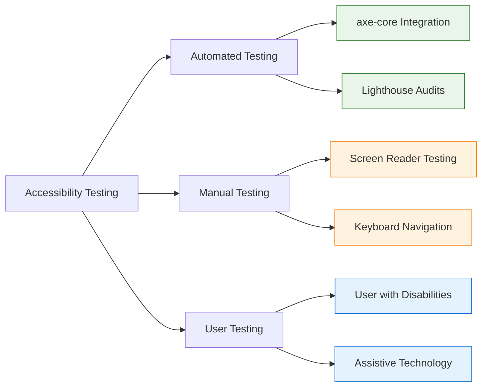

## مراحل پیاده‌سازی

### مرحله ۱: پایه تحلیل بسته (هفته ۱-۲)
- پیاده‌سازی پلاگین تحلیلگر بسته Vite
- ایجاد داشبورد مانیتورینگ حجم بسته
- راه‌اندازی جمع‌آوری معیارهای عملکرد
- ایجاد تست رگرسیون اندازه

### مرحله ۲: یکپارچگی React Query (هفته ۲-۳)
- تنظیم React Query client
- مهاجرت state موجود به React Query
- پیاده‌سازی به‌روزرسانی‌های خوش‌بینانه
- افزودن پشتیبانی آفلاین و مرزهای خطا

### مرحله ۳: تقویت لمس موبایل (هفته ۳-۴)
- پیاده‌سازی سیستم تشخیص حرکات
- افزودن انیمیشن‌های فنری برای تعاملات
- بهینه‌سازی اهداف لمسی و فاصله‌گذاری
- فعالسازی بازخورد لمسی برای دستگاه‌های موبایل

### مرحله ۴: پیاده‌سازی دسترسی‌پذیری (هفته ۴-۵)
- افزودن برچسب‌های جامع ARIA
- پیاده‌سازی میانبرهای ناوبری کیبورد
- ایجاد اعلامیه‌های صفحه‌خوان
- افزودن سیستم مدیریت فوکوس

### مرحله ۵: بهینه‌سازی عملکرد (هفته ۵-۶)
- بهینه‌سازی استراتژی تقسیم بسته
- پیاده‌سازی مکانیزم‌های پیشرفته کش
- افزودن پیش‌بارگیری پیش‌بینی‌کننده
- تنظیم دقیق مانیتورینگ عملکرد

## مانیتورینگ و معیارها

### داشبورد عملکرد زمان واقعی

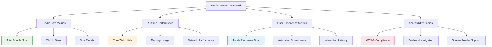

### سیستم هشدار

| معیار | آستانه | عمل | اطلاعرسانی |
|--------|-----------|--------|--------------|
| حجم بسته | > ۵۰۰ کیلوبایت | مسدود کردن استقرار | ایمیل + اسلک |
| LCP | > ۲.۵ ثانیه | بررسی عملکرد | هشدار داشبورد |
| FID | > ۱۰۰ میلی‌ثانیه | بررسی | تحلیل لاگ |
| امتیاز دسترسی‌پذیری | < ۹۵% | حسابرسی لازم | اطلاع تیم |

این طراحی جامع پایه‌ای محکم برای پیاده‌سازی مانیتورینگ حجم بسته، بهینه‌سازی موبایل، تقویت دسترسی‌پذیری، و یکپارچگی React Query ارائه می‌دهد در حالی که معماری موجود را حفظ می‌کند و از الگوهای مستقر شده در اپلیکیشن نما-۱ پیروی می‌کند.