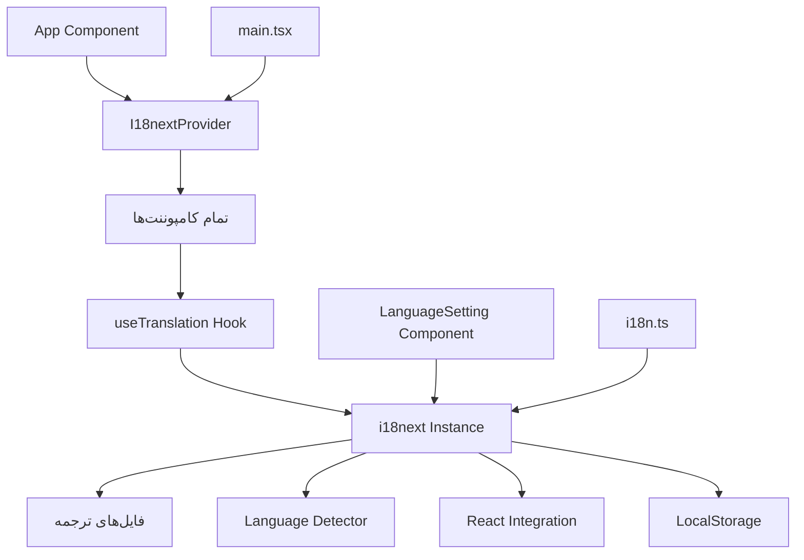
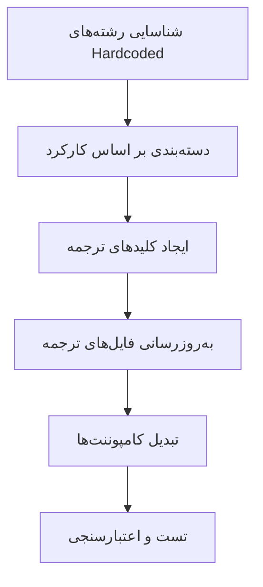
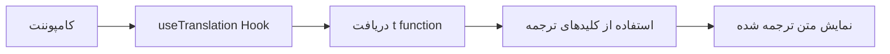

# طراحی تبدیل رشته‌های Hardcoded به کلیدهای ترجمه

## مقدمه

پروژه Nama-1 در حال حاضر از سیستم بین‌المللی‌سازی (i18n) با استفاده از react-i18next بهره می‌برد و از دو زبان انگلیسی و فارسی پشتیبانی می‌کند. با این حال، تحلیل کدبیس نشان می‌دهد که هنوز رشته‌های hardcoded متعددی در کامپوننت‌ها وجود دارند که باید به کلیدهای ترجمه تبدیل شوند. این پروژه برای یکپارچه‌سازی کامل سیستم ترجمه و بهینه‌سازی کد ضروری است.

## معماری فعلی i18n



### فایل‌های ترجمه موجود

- `public/locales/en/translation.json` - ترجمه‌های انگلیسی
- `public/locales/fa/translation.json` - ترجمه‌های فارسی

### ساختار کلیدهای ترجمه فعلی

```typescript
{
  "contact_form": {
    "group": "گروه",
    "select_group": "انتخاب گروه",
    "company": "شرکت"
  },
  "common": {
    "save": "ذخیره",
    "cancel": "لغو",
    "loading": "در حال بارگذاری..."
  },
  "settings": {
    "title": "تنظیمات",
    "language": "زبان"
  }
}
```

## تحلیل رشته‌های Hardcoded شناسایی شده

### کامپوننت‌های اولویت‌دار

#### 1. AddGroupDialog.tsx

**رشته‌های hardcoded شناسایی شده:**
- `"افزودن گروه جدید"` - متن دکمه
- `"در حال آماده‌سازی فرم گروه..."` - پیام لودینگ
- `"خطا در بارگذاری رنگ‌های گروه‌های موجود."` - پیام خطا
- `"بستن"` - متن دکمه

#### 2. ContactForm.tsx

**رشته‌های hardcoded شناسایی شده:**
- `"الزامی است."` - پیام اعتبارسنجی
- پیام‌های console.log مختلف

#### 3. سایر کامپوننت‌ها

**الگوهای مشترک شناسایی شده:**
- پیام‌های خطا و موفقیت
- برچسب‌های فرم
- متن‌های دکمه
- پیام‌های تأیید
- پیام‌های لودینگ

## طراحی راه‌حل

### 1. استراتژی تبدیل



### 2. ساختار کلیدهای ترجمه پیشنهادی

#### الف) پیام‌های خطا
```json
{
  "errors": {
    "loading_group_colors": "خطا در بارگذاری رنگ‌های گروه‌های موجود",
    "field_required": "{{field}} الزامی است",
    "generic_error": "خطایی رخ داده است"
  }
}
```

#### ب) اقدامات و دکمه‌ها
```json
{
  "actions": {
    "add_new_group": "افزودن گروه جدید",
    "close": "بستن",
    "save_changes": "ذخیره تغییرات",
    "cancel_operation": "لغو عملیات"
  }
}
```

#### ج) پیام‌های سیستم
```json
{
  "system_messages": {
    "preparing_group_form": "در حال آماده‌سازی فرم گروه...",
    "processing_request": "در حال پردازش درخواست...",
    "operation_completed": "عملیات با موفقیت انجام شد"
  }
}
```

### 3. معماری کامپوننت‌های به‌روزرسانی شده



## پیاده‌سازی تفصیلی

### 1. به‌روزرسانی فایل‌های ترجمه

#### فایل انگلیسی (en/translation.json)
```json
{
  "group_dialog": {
    "add_new_group": "Add New Group",
    "preparing_form": "Preparing group form...",
    "loading_colors_error": "Error loading existing group colors",
    "close": "Close"
  },
  "form_validation": {
    "field_required": "{{field}} is required",
    "invalid_format": "Invalid {{field}} format"
  },
  "accessibility": {
    "edit_contact_form": "Edit Contact Form",
    "add_contact_form": "Add Contact Form",
    "edit_contact_description": "Edit contact information and details",
    "add_contact_description": "Add new contact information and details",
    "updating_contact": "Updating contact...",
    "creating_contact": "Creating contact...",
    "form_error": "Form error: {{message}}"
  }
}
```

#### فایل فارسی (fa/translation.json)
```json
{
  "group_dialog": {
    "add_new_group": "افزودن گروه جدید",
    "preparing_form": "در حال آماده‌سازی فرم گروه...",
    "loading_colors_error": "خطا در بارگذاری رنگ‌های گروه‌های موجود",
    "close": "بستن"
  },
  "form_validation": {
    "field_required": "{{field}} الزامی است",
    "invalid_format": "فرمت {{field}} نامعتبر است"
  },
  "accessibility": {
    "edit_contact_form": "فرم ویرایش مخاطب",
    "add_contact_form": "فرم افزودن مخاطب",
    "edit_contact_description": "ویرایش اطلاعات و جزئیات مخاطب",
    "add_contact_description": "افزودن اطلاعات و جزئیات مخاطب جدید",
    "updating_contact": "در حال به‌روزرسانی مخاطب...",
    "creating_contact": "در حال ایجاد مخاطب...",
    "form_error": "خطای فرم: {{message}}"
  }
}
```

### 2. الگوی تبدیل کامپوننت‌ها

#### قبل از تبدیل:
```tsx
const AddGroupDialog = () => {
  return (
    <Button>
      افزودن گروه جدید
    </Button>
  );
};
```

#### بعد از تبدیل:
```tsx
const AddGroupDialog = () => {
  const { t } = useTranslation();
  
  return (
    <Button>
      {t('group_dialog.add_new_group')}
    </Button>
  );
};
```

### 3. مدیریت پیام‌های خطا

#### الگوی پیشنهادی برای ErrorManager:
```tsx
// قبل
ErrorManager.notifyUser("خطا در بارگذاری رنگ‌های گروه‌های موجود.", 'error');

// بعد
ErrorManager.notifyUser(t('errors.loading_group_colors'), 'error');
```

### 4. اعتبارسنجی فرم‌ها

#### الگوی پیشنهادی:
```tsx
const formSchema = useMemo(() => {
  return contactFormSchema.superRefine((data, ctx) => {
    if (data.customFields) {
      data.customFields.forEach((field, index) => {
        const template = availableTemplates.find(t => t.id === field.template_id);
        if (template && template.required && (!field.value || field.value.trim() === '')) {
          ctx.addIssue({
            code: z.ZodIssueCode.custom,
            message: t('form_validation.field_required', { field: template.name }),
            path: [`customFields`, index, `value`],
          });
        }
      });
    }
  });
}, [availableTemplates, t]);
```

## فرآیند مهاجرت

### فاز 1: آماده‌سازی
1. **تحلیل جامع کدبیس**
   - شناسایی تمام رشته‌های hardcoded
   - دسته‌بندی بر اساس کارکرد
   - اولویت‌بندی بر اساس اهمیت

2. **طراحی ساختار کلیدها**
   - تعریف convention نام‌گذاری
   - ایجاد hierarchy منطقی
   - تعریف namespace‌ها

### فاز 2: پیاده‌سازی
1. **به‌روزرسانی فایل‌های ترجمه**
   - افزودن کلیدهای جدید
   - تست سازگاری
   - بررسی ترجمه‌های موجود

2. **تبدیل کامپوننت‌ها**
   - شروع از کامپوننت‌های پایه
   - تبدیل تدریجی
   - تست هر مرحله

### فاز 3: اعتبارسنجی
1. **تست عملکرد**
   - بررسی تغییر زبان
   - تست در محیط‌های مختلف
   - اعتبارسنجی RTL/LTR

2. **بررسی کیفیت**
   - Code review
   - تست accessibility
   - Performance testing

## ابزارها و تکنیک‌های پیشنهادی

### 1. اسکریپت شناسایی خودکار

```bash
# جستجوی رشته‌های فارسی hardcoded
grep -r "[\u0600-\u06FF]" src/ --include="*.tsx" --include="*.ts"

# جستجوی رشته‌های انگلیسی hardcoded
grep -rE "['\""][A-Z][a-zA-Z\s]{3,}['\""]" src/ --include="*.tsx"
```

### 2. Lint Rules

```javascript
// ESLint rule برای شناسایی رشته‌های hardcoded
{
  "rules": {
    "no-hardcoded-strings": "error"
  }
}
```

### 3. Type Safety

```typescript
// تعریف type-safe keys
type TranslationKeys = 
  | 'group_dialog.add_new_group'
  | 'group_dialog.preparing_form'
  | 'errors.loading_group_colors';

const t = (key: TranslationKeys, options?: any) => useTranslation().t(key, options);
```

## معیارهای پذیرش

### 1. معیارهای تکنیکی
- ✅ حذف ۱۰۰٪ رشته‌های hardcoded شناسایی شده
- ✅ حفظ عملکرد موجود
- ✅ پاس کردن تمام تست‌ها
- ✅ عدم تغییر در UX

### 2. معیارهای کیفی
- ✅ سازگاری کامل با RTL/LTR
- ✅ ترجمه‌های دقیق و مناسب
- ✅ consistency در نام‌گذاری کلیدها
- ✅ maintainability بهبود یافته

### 3. معیارهای عملکرد
- ✅ عدم افزایش bundle size
- ✅ حفظ سرعت تغییر زبان
- ✅ عدم memory leaks

## مزایای پیاده‌سازی

### 1. مزایای کوتاه‌مدت
- **یکپارچگی UI**: تمام متن‌ها از یک منبع واحد
- **سهولت نگهداری**: تغییرات متنی فقط در فایل‌های ترجمه
- **کیفیت کد**: حذف hardcoded strings

### 2. مزایای بلندمدت
- **Scalability**: آمادگی برای افزودن زبان‌های جدید
- **Maintainability**: کاهش technical debt
- **Developer Experience**: workflow بهتر برای تغییرات متنی

### 3. مزایای کاربری
- **Consistency**: تجربه یکپارچه در تمام بخش‌ها
- **Accessibility**: پشتیبانی بهتر از screen readers
- **Localization**: ترجمه‌های دقیق‌تر و مناسب‌تر

## ریسک‌ها و راه‌حل‌ها

### 1. ریسک‌های تکنیکی

#### مشکل: Breaking Changes
**راه‌حل**: 
- تبدیل تدریجی
- Backward compatibility
- تست مداوم

#### مشکل: Performance Impact
**راه‌حل**:
- Lazy loading ترجمه‌ها
- Tree shaking
- Bundle optimization

### 2. ریسک‌های محتوایی

#### مشکل: ترجمه‌های نادرست
**راه‌حل**:
- Review process
- Native speaker validation
- Context documentation

#### مشکل: Missing keys
**راه‌حل**:
- Fallback mechanism
- Development warnings
- Automated testing

## نتیجه‌گیری

تبدیل رشته‌های hardcoded به سیستم ترجمه یکپارچه، گامی مهم در بهبود کیفیت، نگهداری و قابلیت‌های بین‌المللی‌سازی پروژه Nama-1 است. با اجرای این طراحی، پروژه آمادگی کاملی برای توسعه آینده و افزودن زبان‌های جدید خواهد داشت.