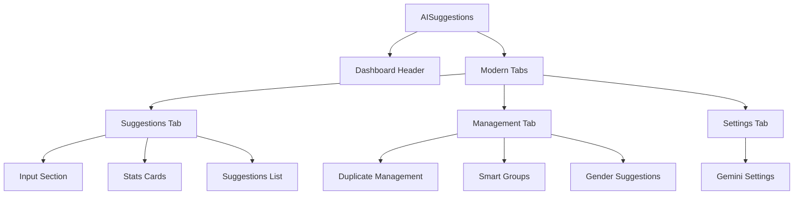

# پلن ریفکتور کامپوننت AISuggestions.tsx

## تحلیل مشکلات فعلی
- کامپوننت خیلی بزرگ (650 خط)
- فضای زیادی اشغال می‌کند
- گرید‌های پیچیده و شلوغ
- انیمیشن‌های زیاد
- چایلد ها استایل‌های ناسازگار دارند
- سازماندهی ضعیف محتوا

## اهداف طراحی جدید
- طراحی مدرن داشبورد وار
- کاهش فضای اشغال شده
- سازماندهی بهتر با استفاده از تب‌ها
- کاهش انیمیشن‌ها
- بهبود responsive بودن
- استفاده از کامپوننت‌های پایه مشترک

## معماری جدید

## TODO List

### فاز ۱: آماده‌سازی
- [ ] بررسی و تحلیل کامپوننت‌های موجود
- [ ] شناسایی کامپوننت‌های پایه قابل استفاده مجدد
- [ ] طراحی wireframe جدید داشبورد

### فاز ۲: پیاده‌سازی ساختار پایه
- [ ] ایجاد کامپوننت DashboardLayout جدید
- [ ] پیاده‌سازی سیستم تب‌بندی با ModernTabs
- [ ] ایجاد کامپوننت CompactStats برای آمار کلیدی

### فاز ۳: ریفکتور بخش‌های اصلی
- [ ] ریفکتور بخش پیشنهادات (AISuggestions tab)
- [ ] ریفکتور بخش مدیریت (Management tab)
- [ ] ریفکتور بخش تنظیمات (Settings tab)

### فاز ۴: بهینه‌سازی کامپوننت‌های چایلد
- [ ] بهینه‌سازی AISuggestionCard برای فضای کمتر
- [ ] بهینه‌سازی DuplicateContactManagement
- [ ] بهینه‌سازی SmartGroupManagement
- [ ] بهینه‌سازی GenderSuggestionManagement
- [ ] بهینه‌سازی GeminiSettings

### فاز ۵: بهبود UX و تست
- [ ] پیاده‌سازی loading states بهینه‌تر
- [ ] بهبود empty states
- [ ] تست responsive بودن در دستگاه‌های مختلف
- [ ] بررسی عملکرد و بهینه‌سازی

### فاز ۶: نهایی‌سازی
- [ ] پاکسازی کدهای قدیمی
- [ ] به‌روزرسانی مستندات
- [ ] تست نهایی و QA